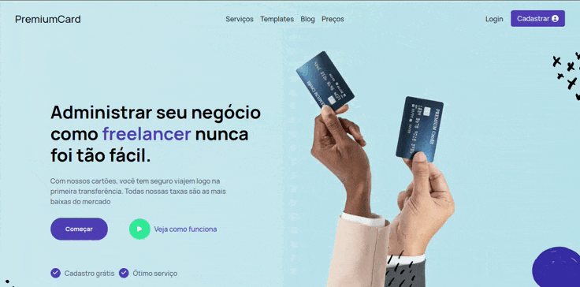

# README
## LiveServer(Railway)
Link para acessar o site - [PremiumCard](https://premiumcard.up.railway.app/)

## Overview
Trabalhei neste projeto por 1 mês, estudando tecnologias como:

- Nodejs
- Express
- MongoDB



Além do seu design fiel ao projeto original 
seu sistema de autenticação e criptografia funcionam perfeitamente juntos


## Referências

_Fontes do Google Fonts - [GoogleFonts](https://fonts.google.com/)_  
_Baseado em design do Figma -  [AR Shakir](https://www.arshakir.com/project/saas-landing-page-freebie-4)._  
_Ilustrações e ícones vem do Icons8 - [Icons8](https://icons8.com/)_

## Developer area

| Dev.Dependencies | Dependencies |
|:-------------:|:-------------:|
| Webpack | Bootstrap |
| Babel | FontAwesome |
| Nodemon | Express |
| css-loader | Mongoose |
| style-loader | helmet |
| SASS | bcryptjs |
| ----- | csurf |
| ----- | dotenv |
| ----- | validator |

Template Engine: _**EJS**_;  
Banco de dados(NoSQL): _**MongoDB**_;

### Instalação

```
npm install
```

## Main Goals

_Criar base do site -_ _**Finished**_  
_Outros detalhes -_ _**Finished**_  
_Responsive -_ _**Finished**_  
_MVC -_ _**Finished**_  
_Criptografia de senha -_ _**Finished**_  
_Animações -_ _**Finished**_  
